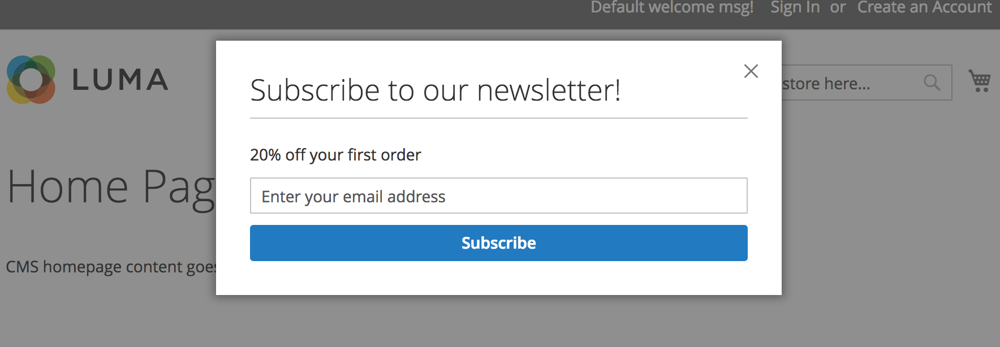
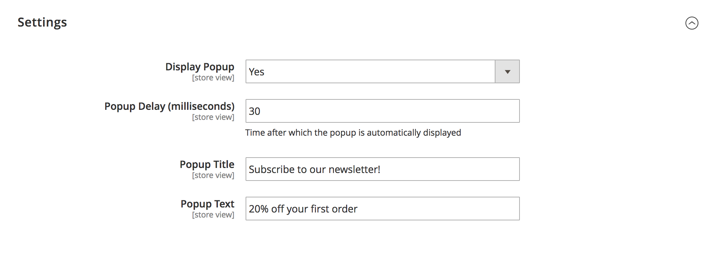

# Magento2 newsletter subscribe #

A newsletter subscribing form that appears **once** after a certain number of seconds until set cookie expire.



Installation Instructions
--------------------------
Add these lines to the composer.json of your project

```
"require":{
    ...
    "bitbull/magento2-module-newsletter-popup": "2.0.0"
 }
 ```
 
 ```
 "repositories":[
      ...
     {
        "type": "vcs",
        "url":"https://github.com/bitbull-team/magento2-module-newsletterpopup.git"
     }
 ]
```

Settings
--------

After install go to **Stores -> Configuration -> Bitbull -> Newsletter Popup** and set _Display popup_ to yes. 


 

Changelog
----------

* 2.0.0 - Moved module under Bitbull tab and refactoring module name occurrences
* 1.0.1 - Added single validation id
* 1.0.0 - First release


Licence
-------

[OSL - Open Software Licence 3.0](http://opensource.org/licenses/osl-3.0.php)


Copyright
---------
(c) 2016 Bitbull Srl
